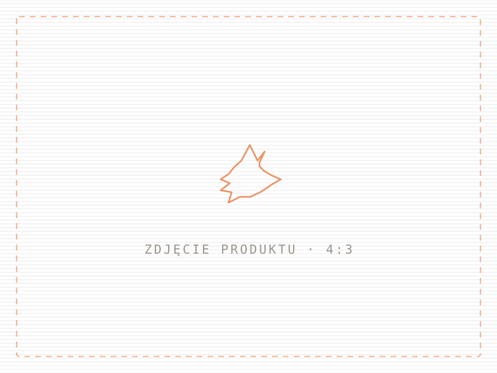

# Fox3D — strona sklepu z drukiem 3D

Statyczna strona wizytówka dla warsztatu druku 3D. Bez frameworka, bez backendu,
bez bazy danych — czysty HTML, CSS i JavaScript. Wrzucasz pliki na hosting i działa.

## Uruchomienie

Otwórz `index.html` w przeglądarce. Tyle. Nic nie trzeba instalować ani budować.

## Struktura

| Ścieżka | Co to |
| --- | --- |
| `index.html` | Cała strona. Wszystkie treści są tutaj. |
| `assets/css/style.css` | Style i tokeny kolorów obu motywów. |
| `assets/js/main.js` | Przełącznik motywu, lisek w tle, listwa Z, formularz. |
| `assets/img/` | Zdjęcia produktów (na razie placeholder). |
| `favicon.svg` | Ikonka w karcie przeglądarki. |
| `design/koncepcja-wizualna.html` | Koncepcja kierunku wizualnego — paleta, typografia, mapa strony. |
| `tools/bundle.py` | Skleja stronę w jeden plik HTML do wysłania komuś bez hostingu. |

---

## Co podmienić przed publikacją

W `index.html` wszystkie miejsca do zmiany są opisane komentarzem `<!-- ZMIEŃ: ... -->`.

### 1. Linki do profili

Występują w dwóch miejscach — w sekcji „Gdzie kupić" i w stopce. Podmień oba:

```html
https://www.tiktok.com/@fox3d          →  Twój profil TikTok
https://www.vinted.pl/member/fox3d     →  Twój profil Vinted
https://www.olx.pl/oferty/uzytkownik/fox3d/  →  Twój profil OLX
```

Nie używasz OLX? Usuń kafel `<a class="market m-olx">` i link ze stopki — układ sam się
domknie, nie zostanie dziura.

### 2. Adres e-mail

Szukaj `kontakt@fox3d.pl` (stopka + formularz wyceny). Formularz sam podłącza się pod
adres z linku o `id="mailLink"` — wystarczy zmienić go w jednym miejscu i w stopce.

### 3. Zdjęcia produktów

Wrzuć pliki do `assets/img/` i podmień `src` w każdym ``:

```html


```

Proporcja **4:3**, zalecany rozmiar **1200 × 900 px**, format `.webp` lub `.jpg`.
Opis w `alt` napisz normalnym zdaniem — czytają go wyszukiwarki i czytniki ekranu.

### 4. Produkty i ceny

Karty w sekcji `<section id="katalog">`. Każda to jeden blok `<article class="card">` —
skopiuj i zmień treść, żeby dodać kolejny produkt. Parametry (`PLA`, `0,12 mm`, czas druku)
to elementy `<li class="chip">`.

Sprawdź też, czy zgadzają się dane w sekcji „O Fox3D" (pole robocze, materiały)
i w FAQ (ceny wysyłki, terminy).

---

## Jak to jest zrobione

### Lisek w tle

Głowa lisa z logo jest **pocięta na 52 warstwy** i rysowana na `<canvas>` — dokładnie tak,
jak zrobiłby to slicer przed drukiem. Stos obraca się wolno wokół osi Y, a po warstwach
sunie rozjaśnienie udające przejazd głowicy. Kontur siedzi w `assets/js/main.js` jako
tablica `FOX`; zmiana kształtu to zmiana współrzędnych, nie grzebanie w grafice.

Animacja zatrzymuje się, gdy hero zjedzie z ekranu albo karta przeglądarki straci
aktywność — nie zżera baterii w tle.

### Motywy

Trzy stany: systemowy, wymuszony jasny, wymuszony ciemny. Wybór zapisuje się w
`localStorage` pod kluczem `fox3d-theme`. Kolejność w CSS:

```
:root                                    → paleta jasna
@media (prefers-color-scheme: dark)
  :root:not([data-theme="light"])        → paleta ciemna z ustawień systemu
:root[data-theme="dark"]                 → paleta ciemna z przełącznika
```

Żaden kolor nie jest zdefiniowany wyłącznie wewnątrz media query — to najczęstsza
przyczyna stron, które w jednym trybie mają nieczytelny tekst.

### Paleta

| Token | Ciemny | Jasny | Rola |
| --- | --- | --- | --- |
| `--flame` | `#F4661B` | `#E2560F` | akcent: CTA, ceny, stan aktywny |
| `--ember` | `#FF9445` | `#FF8A2B` | rozjaśnienie w gradientach i hover |
| `--ground` | `#0F0C0A` | `#E7E4E0` | tło strony |
| `--surface` | `#171310` | `#F6F4F2` | karty i powierzchnie |
| `--ink` | `#F2EFEC` | `#17110C` | tekst |
| `--support` | `#3FA8B4` | `#1F6F79` | tylko etykiety materiału |

Szarości są ciepłe — z domieszką pomarańczu. Pomarańcz na jasnym tle jest przyciemniony,
oryginalny nie przechodzi kontrastu.

### Formularz wyceny

Nie ma serwera, więc formularz składa gotową wiadomość i otwiera program pocztowy
(`mailto:`). Działa wszędzie i nic nie kosztuje. Jeśli kiedyś ma trafiać prosto na
skrzynkę bez otwierania klienta poczty, najprościej podpiąć Formspree albo Netlify Forms —
zmiana dotyczy tylko funkcji obsługującej `submit` w `main.js`.

### Dostępność i wydajność

Strona ma link „przejdź do treści", widoczny stan focus, opisy `alt`, etykiety pól
formularza i pełną obsługę `prefers-reduced-motion` (przy tym ustawieniu lisek stoi,
sekcje nie wjeżdżają, karty się nie podnoszą). Zero zewnętrznych zapytań: brak fontów
z CDN, brak bibliotek, brak trackerów.

---

## Publikacja

**GitHub Pages** — Settings → Pages → Deploy from a branch → `main` / `root`.
Strona pojawi się pod `https://<użytkownik>.github.io/<repo>/`.

**Zwykły hosting FTP** — wgraj `index.html`, katalog `assets/` i `favicon.svg`
do katalogu głównego.

**Jeden plik do wysłania** — `python3 tools/bundle.py` tworzy `dist/fox3d-podglad.html`
ze wszystkim w środku. Można go wysłać mailem albo otworzyć z pendrive'a.

Po wpięciu domeny uzupełnij jeszcze `og:url` i `og:image` w `<head>` — od tego zależy,
jak wygląda podgląd linku wklejonego na TikToku czy Messengerze.
